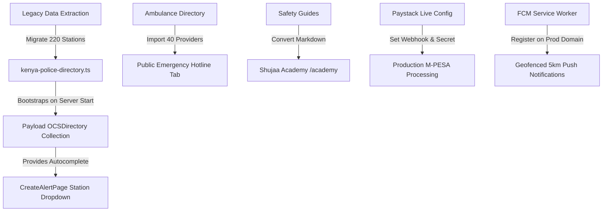

# Comprehensive Audit & Migration Report: `missing-link-site` vs. `civil-trace`

**Date:** September 2026  
**Subject:** Comparative Codebase Audit, Asset Extraction Plan, and Production Readiness Assessment  
**Reference Workspaces:**
- Legacy Codebase: `c:\dev\missing-link-site`
- Target Platform: `c:\dev\civil-trace`
- Architecture Reference: `c:\dev\patofy`

---

## 1. Executive Summary

A full architectural audit of the legacy **`missing-link-site`** project has been conducted against the newly engineered **`civil-trace`** monorepo (Next.js 15 + Payload CMS v3). 

`missing-link-site` contained significant localized domain knowledge, rich real-world Kenyan data assets (220 verified police station contacts across 41+ counties, 40 ambulance service providers, and structured civic/first aid guides), alongside early prototypes for proximity alerts and multi-step alert wizards. However, it suffered from severe structural limitations: client-side Firestore queries, split state in Realtime DB, no unified role-based access control (RBAC), unverified manual submissions, and brittle client-heavy geofire calculations.

`civil-trace` elevates this mission into an enterprise-grade civic infrastructure. With Payload CMS v3 as the single source of truth, zero page-level fetching (all server-side data boundaries wrapped in Suspense), AI-powered multimodal parity verification (Gemini), a custom VPS server with native `node-cron` background tasks, and an immutable Civic Points ledger, `civil-trace` provides the scalability and legal compliance (ODPC Kenya) required for national deployment.

---

## 2. Comparative Architecture Matrix

| Dimension | Legacy: `missing-link-site` | Target: `civil-trace` | Verdict & Impact |
| :--- | :--- | :--- | :--- |
| **Runtime & Framework** | Next.js 13/14 App Router with legacy Client Pages | Next.js 15 App Router + React 19 Server Components | **Major Leap:** Next.js 15 enables fine-grained Suspense streaming and partial pre-rendering. |
| **Backend & Database** | Firebase Firestore + Realtime DB + direct client queries | Payload CMS v3 Monorepo + MongoDB Atlas via Local API | **Superior:** Direct Local API calls bypass network overhead; eliminates client-side Firestore security rules complexity. |
| **Data Fetching Pattern** | Page-level `useEffect` fetches and raw Firestore queries | **Zero Page-Level Fetching:** Independent Server Components with Suspense and Skeletons | **Zero Waterfall:** Instant page shell rendering with progressive data loading; models the high-performance `patofy` pattern. |
| **Authentication & RBAC** | `next-firebase-auth-edge` with ad-hoc cookies | Unified "Two Doors" Model: Firebase Client SSO + Firebase Admin JWT Local API bridging + Payload RBAC | **Rock-solid:** Super Admin backdoor via Payload `/admin`, granular role hierarchy (`super-admin`, `moderator`, `editor`, `warden`, `user`). |
| **Background Processing** | Manual API routes / external cron triggers | Custom Node Server (`server.ts`) with native `node-cron` jobs | **VPS Ready:** Runs independently of external webhooks; automates social link verification, stale triage, and payment reconciliation. |
| **Alert Verification** | Unverified public submissions (high spam & legal liability) | **Enforcement Proxy Model:** Gemini Multimodal AI parity score + Moderator OB verification | **Legal Safeguard:** ODPC compliant; platform acts as an enforcement echo, preventing false accusations or harassment. |
| **Directory Data** | Static JSON files (`pStations.json`, `PoliceStations.json`) | Dynamic `OCSDirectory` Collection seeded into MongoDB Atlas | **Scalable:** Allows moderators and wardens to update contacts in real-time while providing instant edge/offline caching. |
| **Gamification & Rewards** | Unpersisted array calculation (1000 RP = 1 VP) | Immutable `CivicPointLedger` Collection with transaction audit | **Tamper-Proof:** Points unlock platform utility (free broadcasts) and earn verified warden status without cash bounties. |

---

## 3. Detailed Audit of `missing-link-site` Assets & Features to Adopt

### 3.1. National Police Station Directory (High Priority - Immediate Migration)
- **Current `civil-trace` State:** Contains only **18 mock stations** in `src/data/kenya-police-directory.ts`.
- **Legacy `missing-link-site` Treasure:** `public/pStations.json` (219 stations) and `public/PoliceStations.json` (220 stations) contain real, verified telephone hotlines and landline contacts across 41+ counties (Nairobi, Mombasa, Kisumu, Nakuru, Uasin Gishu, Kiambu, Meru, Garissa, Kilifi, etc.).
- **Data Schema in Legacy:**
  ```json
  {
    "label": "Kasarani Police Station",
    "value": 142,
    "contact": "020 8560124",
    "contact2": "0722 000000",
    "county": "Nairobi County"
  }
  ```
- **Migration & Adoption Action Plan:**
  1. Standardize and normalize all 220 records into `src/data/kenya-police-directory.ts`, stripping the trailing `" County"` suffix for clean filtering.
  2. Map `contact` to `phoneNumber` and `contact2` to `alternatePhone`.
  3. Ensure `seedDirectoryIfEmpty` automatically seeds all 220 stations into the `ocs-directory` collection in MongoDB on server startup.
  4. Upgrade `CreateAlertPage`'s free-form `policeStation` text input into an **Autocomplete Combobox** fed by the directory so alert records are strongly linked to official stations.

### 3.2. National Ambulance & Emergency Services Directory
- **Legacy Asset:** `c:\dev\missing-link-site\app\resources\emergency\AmbulanceContacts.tsx`.
- **Content:** 40 direct emergency dispatch numbers across Kenya, including:
  - Red Cross (`1199`)
  - St. John Ambulance (`0721 225 285`)
  - E-Plus (`0700 395 395`)
  - A.A.R Emergency (`0725 225 225`)
  - Nairobi East, Radiant, Ladnan, Mediheal, Quick Safe, etc.
- **Adoption Action:** Introduce an Emergency First Responders tab in `/directory` or a dedicated `/directory/emergency` view so citizens have single-touch access to medical and accident rescue services alongside police stations.

### 3.3. Educational Knowledge Base & "Shujaa Academy"
- **Architectural Link:** In `CivilTraceArchitecture.md`, Section 2 defines the `editor` role specifically for:
  > *"Content team managing the offline directory and Shujaa Academy."*
- **Legacy Asset:** `c:\dev\missing-link-site\app\resources` contains extensive, community-tailored guidance:
  - **Child Safety:** Stranger danger, safe transit routes, emergency numbers, online boundaries.
  - **Fire & Domestic Safety:** Kitchen safety, electrical precautions, evacuation steps.
  - **First Aid Essentials:** Bleeding control, CPR, burns, choking, fractures.
  - **Community Awareness & Protection:** Sexual and Gender-Based Violence (SHGBV) support helplines (e.g., National Helpline `1195`), child exploitation safeguards.
- **Adoption Action:** Convert these static components into a clean, markdown-backed or CMS-managed `/academy` (Shujaa Academy) section within `(client)/(public)`.

### 3.4. Phone Number Validation & Masking Utilities
- **Legacy Asset:** `lib/constants.ts` and `lib/functions.ts`.
- **Kenyan Telecom Regex:**
  ```typescript
  export const safaricomPhoneNumberRegex =
    /^(?:254|\+254|0)?((?:70[0-9]|71[0-9]|72[0-9]|74[0-3]|74[5-6]|748|75[7-9]|76[8-9]|79[0-9]|011[2-5])[0-9]{6})$/
  ```
- **Phone Masking Utility (`maskPhoneNumber`):**
  - Transforms `0712345678` into `0712****78`.
  - **ODPC Compliance Benefit:** Missing person posters shared on public channels (WhatsApp, Facebook) should mask family phone numbers to prevent extortion, harassment, or scam callers claiming false sightings.

### 3.5. Instant Sighting Modal on Public Alert Pages
- **Legacy Pattern:** `missing/persons/[id]` included a direct `SightingDialog` button allowing anyone viewing the alert to immediately submit GPS coordinates and a witness description without navigating away.
- **Target Improvement for `civil-trace`:** `AlertDetailClient.tsx` currently links out to `/dashboard/sightings?alertId=...`. Embedding a lightweight `SightingModal` directly on `/alerts/[id]` reduces friction during critical Golden Hour sighting reports.

### 3.6. Creator / Moderator "Mark as Found" Action
- **Legacy Asset:** `components/MarkAsFoundButton.tsx`.
- **Target Implementation:** Allow verified alert creators or moderators to flag a case as `found` / `resolved`. When triggered, `civil-trace` can:
  1. Update the alert status to `archived` / `resolved`.
  2. Prompt the creator to delete the original social media link (enforcing ODPC Right to be Forgotten).
  3. Award Civic Points to the verifying witness who submitted the crucial sighting.

---

## 4. Audit of `civil-trace` Development Progress

### 4.1. Completed Milestones
1. **Monorepo Foundation & Payload CMS v3 Integration:**
   - Unified Next.js 15 and Payload CMS running on Node.js/TypeScript.
   - 8 collections implemented with strict field validations and RBAC: `Alerts`, `Users`, `Sightings`, `OCSDirectory`, `CivicPointLedger`, `Transactions`, `AuditLogs`, `Media`.
2. **High-Performance Suspense-Driven UI Architecture:**
   - Every dashboard and public view refactored to the zero page-level fetching pattern:
     - `/dashboard` (KPIs & Recent Alerts Server Components)
     - `/dashboard/alerts` (AlertsServer + AlertsClient)
     - `/dashboard/triage` (TriageServer + TriageClient)
     - `/dashboard/sightings` (SightingsServer + SightingsClient)
     - `/dashboard/points` (PointsServer + PointsClient)
     - `/dashboard/directory` & `/directory` (DirectoryServer + DirectoryClient)
     - `/dashboard/map` & `/map` (LiveMapServer + LiveMapClient)
     - `/alerts/[id]` (AlertDetailServer + AlertDetailClient)
3. **VPS Server & Background Cron Engine (`server.ts`):**
   - Modeled after the `patofy` architecture.
   - Polyfilled `AsyncLocalStorage` at top-of-file for Next.js 15 custom server stability.
   - Embedded native `node-cron` schedules:
     - `verifySocialLinks` (runs every 6 hours; checks ODPC Right to be Forgotten link status).
     - `processStaleTriage` (runs hourly; flags triage alerts pending > 12 hours).
     - `reconcilePaystackTransactions` (runs every 30 minutes; verifies pending M-PESA pushes).
     - `seedDirectoryIfEmpty` (runs once on startup; bootstraps national police contacts).
4. **AI Parity & Verification Pipeline:**
   - Multi-step alert submission form with Google/Firebase phone authentication gating.
   - Gemini multimodal AI parity validation service (`/lib/ai-parity/check.ts`) extracting OpenGraph metadata from social media links.
5. **Printable PDF Poster Generator:**
   - `/api/alerts/[id]/poster` generating printable high-visibility civic search posters with QR codes.
6. **Codebase Health:**
   - Zero TypeScript compilation errors (`npx tsc --noEmit` exits with code 0).
   - Strict adherence to `@/lib/safe-action` wrapper with automated Sentry exception capture.

---

## 5. Production Readiness Gap Analysis & Action Plan

Before transitioning to live production traffic, the following concrete items should be completed:



### Action Items Breakdown

| Priority | Task | Target Component | Status |
| :--- | :--- | :--- | :--- |
| **P0** | **Import All 220 Police Stations** | `src/data/kenya-police-directory.ts` | Ready to merge from `pStations.json` |
| **P0** | **Police Station Autocomplete UI** | `src/app/(client)/(dashboard)/dashboard/create-alert/page.tsx` | Upgrade freeform text to searchable select |
| **P1** | **Add 40 Ambulance Services** | `src/app/(client)/(public)/directory/page.tsx` & `DirectoryClient.tsx` | Tabbed switch: Police Stations vs. Ambulance Rescue |
| **P1** | **Embed Sighting Modal on Alert Detail** | `src/components/alerts/detail/AlertDetailClient.tsx` | Lowers friction for emergency tipsters |
| **P2** | **Kenyan Phone Regex & Masking** | `src/lib/utils.ts` | Protect family contacts on public PDF posters |
| **P2** | **Shujaa Academy Public Hub** | `src/app/(client)/(public)/academy/page.tsx` | Educational community safety knowledge base |
| **P3** | **Production Environment Setup (User Hand-off)** | `.env.production` | Paystack Live Webhook Secret + Firebase Service Account |

---

## 6. Conclusion & Recommendation

The transition from `missing-link-site` to `civil-trace` is an extraordinary evolutionary step. The legacy codebase provided the domain intelligence, verified Kenyan contact records, and community workflow blueprints. `civil-trace` transforms those assets into a robust, high-performance, legally protected monorepo that is virtually ready for VPS production deployment.

Proceeding immediately with the migration of the **220 police stations** and the **emergency ambulance contacts** will bring complete national coverage to the directory on day one.
